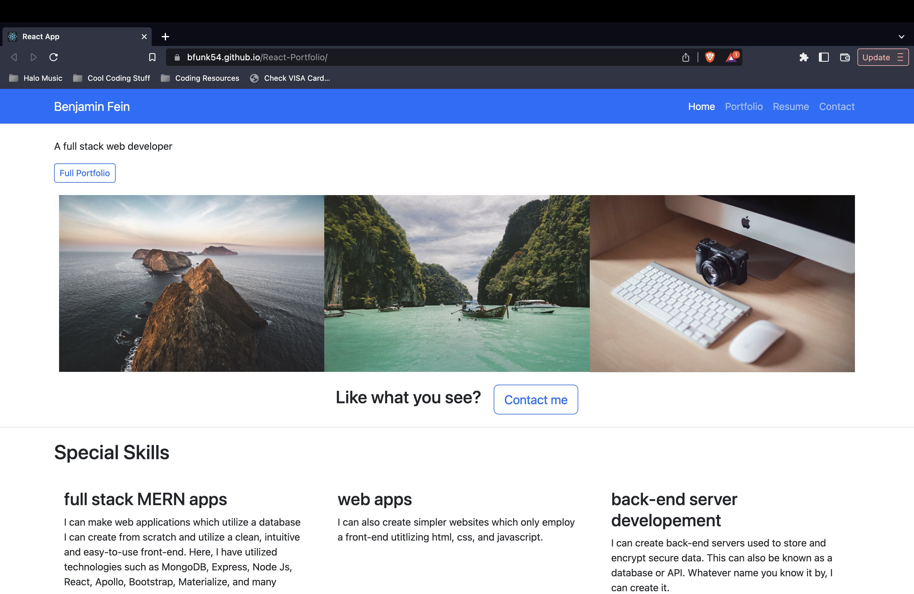

# 

# React Portfolio

## Description
This is the best representation of myself. A website made from stratch utilizing the newest technologies and is just the perfect way to showcase all the work I've done and my abilities as a developer.

## Table of Contents
1. [License](#license)
#
2. [Contribute](#contributing)
#
3. [Screenshots](#screenshots)
#
4. [Questions](#questions)

(<a href="#creative-commons">back to top</a>)

## License
#
[Creative Commons](https://creativecommons.org/)

(<a href="#creative-commons">back to top</a>)

## Contributing
#
Bfunk54/React-Portfolio

(<a href="#creative-commons">back to top</a>)

## Screenshots
#

(<a href="creative-commons">back to top</a>)

## Questions
#
Github: https://github.com/Bfunk54
#
Email me with any questions: ben_fein@icloud.com

(<a href="#creative-commons">back to top</a>)

## Links
#
[React Portfolio](https://bfunk54.github.io/React-Portfolio)
#
[Github Repo](https://github.com/Bfunk54/React-Portfolio)

(<a href="#creative-commons">back to top</a>)

